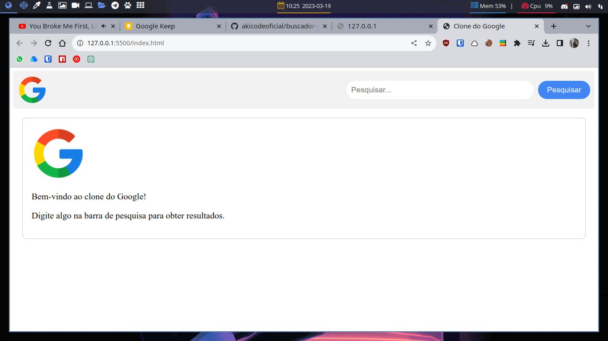

# Clone do Buscador do Google

Este é um projeto de clone do buscador do Google criado com HTML, CSS e JS. Ele apresenta uma interface semelhante à do Google e permite que o usuário pesquise por termos e visualize resultados relacionados. O projeto é responsivo e se adapta a diferentes tamanhos de tela.

O objetivo deste projeto é praticar habilidades em HTML, CSS e JS, bem como aprender mais sobre a construção de interfaces de usuário e integração com APIs de pesquisa. Fique à vontade para contribuir com melhorias e novas funcionalidades, ou usar o projeto como base para seus próprios projetos.

Acesse: [Site](https://akicodeoficial.github.io/buscador-google-clone/)

